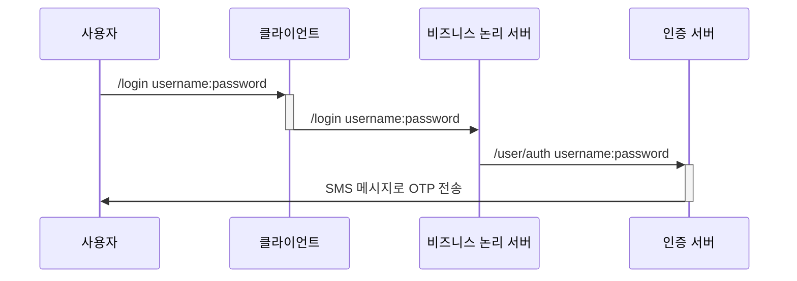
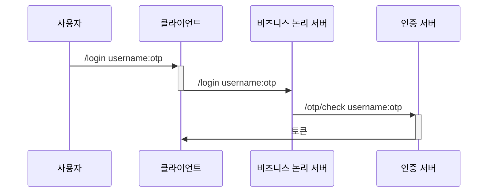
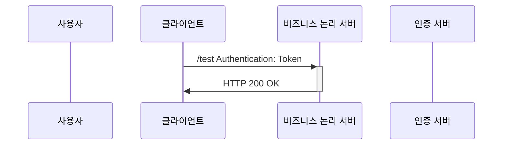

# 비즈니스 논리 서버 구현

## REQUIREMENT
1. 보호할 리소스에 해당하는 앤드포인트를 만든다.
2. 클라이언트가 사용자 자격 증명(사용자 이름 및 암호)을 비즈니스 논리 서버로 보내고 로그인하는 첫 번재 인증 단계를 구현한다.
3. 클라이언트가 인증 서버에서 사용자가 받은 OTP 를 비즈니스 논리 서버로 보내는 두 번째 인증 단계를 구현한다. OTP 로 인증되면, 클라이언트는 사용자의 리소스에 접근하는데 필요한 JWT 를 받는다.
4. JWT 기반 권한 부여를 구현한다. 비즈니스 논리 서버가 클라이언트에서 받은 JWT 를 검증하고 올바르면 클라이언트가 리소스에 접근할 수 있게 허용한다.

## SPECIFICATION
1. 비즈니스 논리 서버 프로젝트를 만든다. `ssia-ch11-ex1-s2` 라고 이름을 지정했다.
2. 두 인증 단계를 나타내는 역할을 하는 `Authentication 객체`를 구현한다.
3. 인증 서버와 비즈니스 논리 서버 간의 통신을 수행하는 프록시를 구현한다.
4. 2단계에서 정의된 `Authentication 객체`로 두 인증 단계의 인증 논리를 구현하는 `AuthenticationProvider 객체`를 정의한다.
5. HTTP 요청을 가로채고 `AuthenticationProvider 객체`로 구현하는 인증 논리를 적용하는 맞춤형 필터 객체를 정의한다.
6. 권한 부여 구성을 작성한다.

## Sequence Diagram
- OTP 를 받기 위해 사용자 이름과 암호로 인증

- 토큰을 받기 위해 OTP 로 인증

- 마지막 인증 단계
